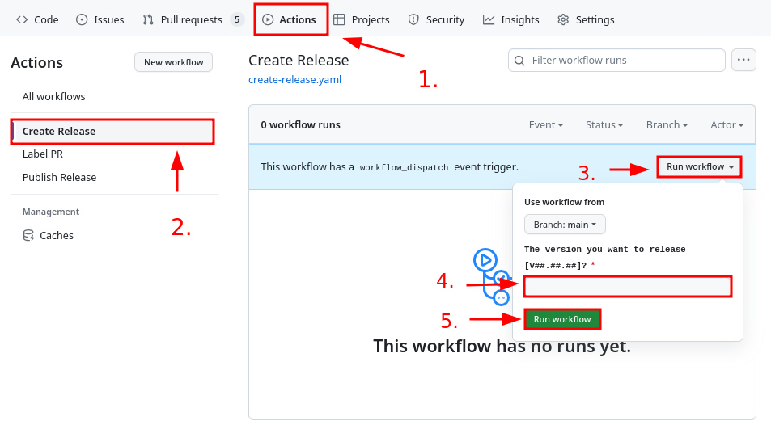

# Basic

## Description

Workflows in this group automate the release process in a _Trunk-based development_ like fashion. If
you are unsure what that means please refer to [IRNAS's Guidelines] document.

Specifically, they automate:

- Preparation of contents of the `CHANGELOG.md` file for the next version entry.
- Tagging and creating GitHub Releases with Release notes that are identical to the latest version
  entry in the `CHANGELOG.md` file.
- Labeling of PRs.

## How to use

This group contains three workflows:

- `create-release.yaml`
- `publish-release.yaml`
- `label_pr.yaml`

Workflow `create-release.yaml` is triggered by the developer and `publish-release.yaml` is called
inside of it.

You will want to trigger `create-release.yaml` whenever you need to create a new GitHub release.

To manually trigger the workflow you have to:

1. Open your project's GitHub page and click the _Actions_ tab.
2. Select the _Create Release_ option from the left side.
3. Click _Run workflow_ button on the right side.
4. Write the version of the next release that you would like to create.
5. Click _Run workflow_ button.



Workflows `create-release.yaml` and `publish-release.yaml` will then do the following:

- validate the format of the version input,
- checkout `main` branch,
- create a new version entry in `CHANGELOG.md`, move _Unreleased_ section into it, commit the
  changes,
- create a new tag with the given version,
- push new changes,
- Create a GitHub release and copy into it the latest version entry in `CHANGELOG.md`.

Workflow `publish-release.yaml` just labels PRs against `main` branch with the label `pull request`.

## Project dependencies

This group depends on a present "empty" `CHANGELOG.md` file in the project's root directory.

If you do not have it yet please copy it from here:

```markdown
# Changelog

All notable changes to this project will be documented in this file.

The format is based on [Keep a Changelog](https://keepachangelog.com/en/1.0.0/)

## [Unreleased]
```

## Extra stuff

If you want to receive Slack notifications every time the release is made just go to the desired
channel and directly use GitHub subscribe commands:

```code
/github subscribe IRNAS/<repo>
/github unsubscribe IRNAS/<repo> issues pulls commits deployments
```

[irnas's guidelines]: https://github.com/IRNAS/irnas-guidelines-docs
