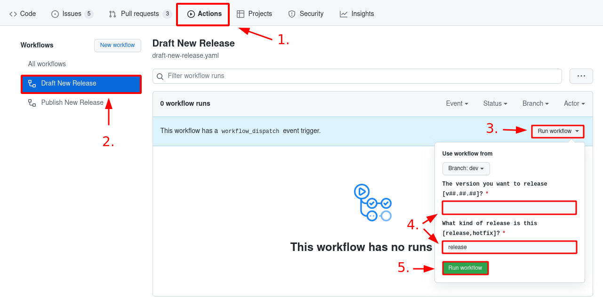

# OLD Basic

**WARNING**: This is an old way of creating releases that is compatible with the
_GitFlow_ workflow but is not compatible with our current branching model. See
**Basic** folder for the workflows that are used currently.

## Description

Workflows in this group automate the release process in a _GitFlow_ like
fashion. If you are unsure what that means please refer to [IRNAS's Guidelines]
document.

Specifically, they automate:

- Creation of release branches.
- Preparation of contents of the `CHANGELOG.md` file for the next version entry.
- Creation of release PRs.
- Tagging and creation of GitHub Release with Release notes that are identical
  to the latest version entry in the `CHANGELOG.md` file.

## How to use

This group contains two workflows:

- `draft-new-release.yaml`
- `publish-new-release.yaml`

Workflow `draft-new-release.yaml` is triggered by the developer, while the
`publish-new-release.yaml` is triggered whenever a pull request is merged into
the `master` branch.

You will want to trigger `draft-new-release.yaml` whenever you think that the
state of the `dev` branch is release ready.

To manually trigger the workflow you have to:

1. Open your project's GitHub page and click the _Actions_ tab.
2. Select the _Draft New Release_ option from the left side.
3. Click _Run workflow_ button on the right side.
4. Write the version of the next release that you would like to create and
   decide on a _kind of release_.
5. Run workflow.



Workflow `draft-new-release.yaml` will then do the following:

- check if `master` exists, if not it will create it (`master` does not exist
  when the project is created from our GitHub project template).
- create `release/<version_number>` branch from either `dev` (you selected
  **_release_**) or `master` (you selected **_hotfix_**) branch.
- Create new version entry in `CHANGELOG.md`, move _Unreleased_ section into it,
  commit and push.
- Open a Pull Request into `master` branch.

Pull Request can then be reviewed, if necessary some final changes can still be
committed to the `release/*` branch.

Merging Pull Request in `master` will trigger a second workflow, which will:

- tag merged commit with the appropriate version.
- Create a GitHub release and copy into it its latest version entry in
  `CHANGELOG.md`.
- Create a Pull Request from `master` back into `dev`.

**Important:** do not forget to merge back the PR into the `dev` branch. This
enables us to bring in Changelog related changes and any other changes that were
done in the release process.

## External dependencies

This group depends on a present "empty" `CHANGELOG.md` file in the project's
root directory.

If you do not have it yet please copy it from here:

```markdown
# Changelog

All notable changes to this project will be documented in this file.

The format is based on [Keep a Changelog](https://keepachangelog.com/en/1.0.0/)

## [Unreleased]
```

If you already have it and you have been adding new versions by hand please call
Marko to your desk. GitHub Action in the workflow that deals with Changelog
updates is picky sometimes.

[irnas's guidelines]: https://github.com/IRNAS/irnas-guidelines-docs

## Extra stuff

If you want to receive Slack notifications everytime are release is made just go
to the channel and directly use Github subscribe commands

```
/github subscribe IRNAS/<repo>
/github unsubscribe IRNAS/<repo> issues pulls commits deployments
```
