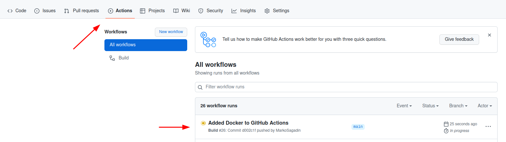
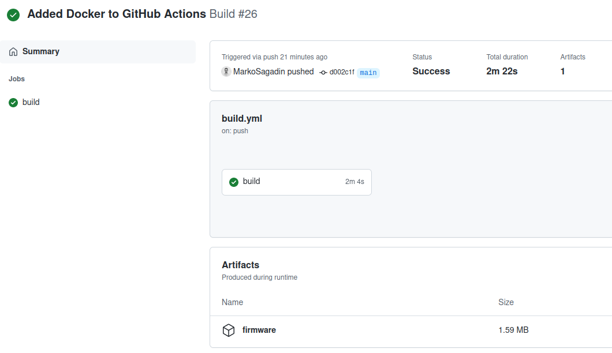

# Zephyr build

## Description

Workflow in this group automates the build process of a Zephyr project.

Specifically it:
* Sets up a Docker Image which contains all necessary tools for building a Zephyr project.
* Builds the Zephyr project.
* Saves created binaries as artefacts.

## External dependencies

Naturally, this workflow is very project-specific, meaning that:
* You should be using the NCS version of a Zephyr.
* Your project should follow the [Out-of-Tree] project structure.
* Your application should be located inside the `app` folder.

## How to use

### Import
Import the workflow files by following the instructions in [How to
import](../../README.md#how-to-import-a-group-of-workflows-into-a-repository-)
section.

### Configure

You will need to configure the `.github/worklows/build.yaml` file according to
your application.
You will have to:
* Change the Docker image under `jobs.build.container.image` to the one you
  need. Currently, only the docker image for NCS v1.8.0 exists.
* Change the name of the west board that is used under the "Build firmware" step.
Currently, the `custom_plank` board is set.

If you are feeling adventurous you can write a small script which will run
several builds, move them and rename them.
"Archive firmware" step could then be pointed to their location.

### Run

A job will run automatically on every push or open pull request to the
**master** branch.

The job will take around 5-7 minutes the first time it is run, however, it
will take around 2 minutes afterwards due to caching.

You can check the progress of the running job under the tab Actions:

### Download artifacts

After the job is done you can click on it and at the bottom you will see
Artefacts window with firmware artefact which you can download.

[Out-of-Tree]: https://github.com/zephyrproject-rtos/example-application
