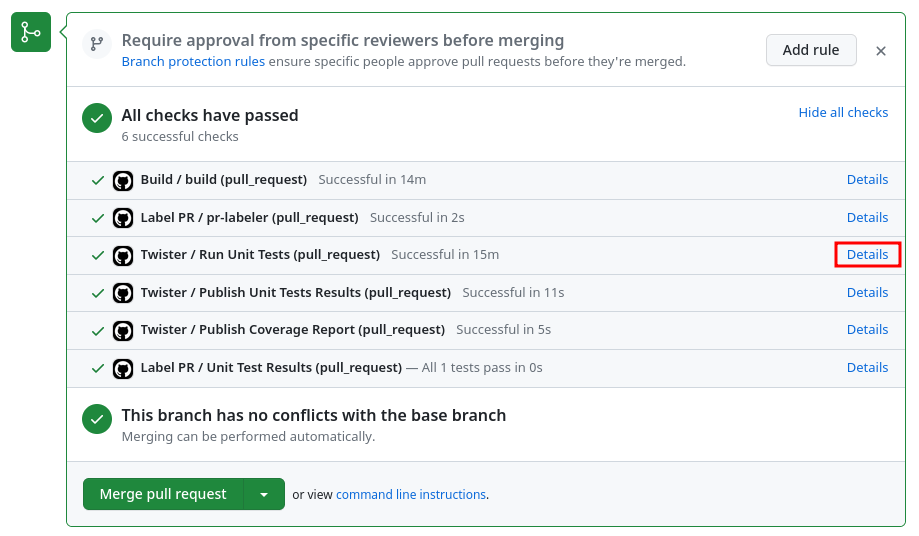
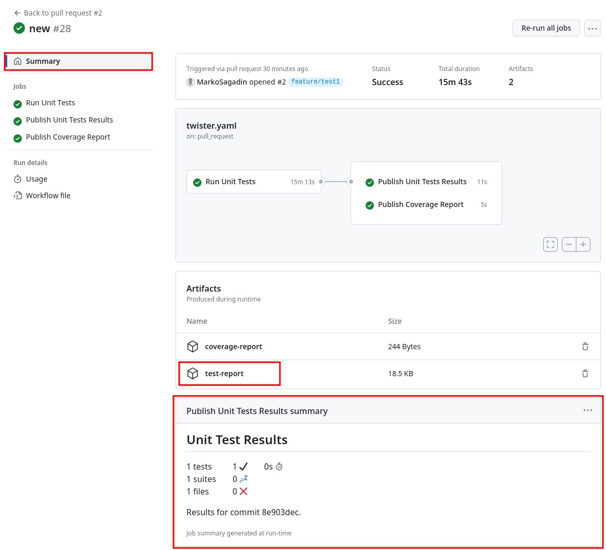

# Zephyr

<!-- vim-markdown-toc GFM -->

- [Description](#description)
- [Dependencies](#dependencies)
  - [GitHub action secrets](#github-action-secrets)
- [How to use](#how-to-use)
  - [Release process](#release-process)
  - [Pull requests](#pull-requests)
- [How to configure build](#how-to-configure-build)
  - [Packaging build artefacts](#packaging-build-artefacts)
  - [Adding extra text to the Release notes](#adding-extra-text-to-the-release-notes)
- [Twister workflow](#twister-workflow)
  - [Artefacts and reports](#artefacts-and-reports)
- [CodeChecker workflow](#codechecker-workflow)
  - [Diff analysis results](#diff-analysis-results)
- [A short note about Make](#a-short-note-about-make)
- [Required GitHub action secrets](#required-github-action-secrets)
  - [General secrets](#general-secrets)
  - [CodeChecker specific secrets](#codechecker-specific-secrets)

<!-- vim-markdown-toc -->

<!-- prettier-ignore -->
> [!WARNING]
> This workflow requires specific GitHub Actions secrets that need to be set.
> See [Required GitHub Action secrets ](#required-github-action-secrets) section.

## Description

Workflows in this group extend the workflows in [Basic](../basic/README.md)
group and introduce several new functionalities which aid in the development of
the projects using Zephyr.

Specifically, they provide:

- Everything that [Basic](../basic/README.md) workflows already do: changelog
  preparation, tagging, publishing GitHub releases, etc.,
- Running various _builds_ on pushes to `main` branch, on Pull Requests and
  during releases processes,
- Running _tests_ on Pull Requests,
- Analysing _builds_ with Codechecker, storing results to the server and
  generating diffs on Pull Requests,
- Caching of West modules, APT packages and toolchains downloaded by East to
  speed up the project setup,
- A way to configure what CI does on project basis without changing workflow
  files,
- A way to specify which artefacts are attached to the published GitHub releases
  for each project,
- A tag and Changelog cleanup steps when _build_ goes wrong and
- A way to add custom text to the release notes.

## Dependencies

Workflows in this group expect specific files to be present in the repository to
function properly. If you created your repository from `irnas-zephyr-template`
then you are all set with basic defaults.

Needed files (relative to project's root dir):

- `scripts/requirements.txt`, can be empty,
- `makefile` - Specific content is expected, see section
  [How to configure _build_](#how-to-configure-build).

### GitHub action secrets

Currently only `codechecker.yaml` requires GitHub Action secrets to work. Check
[CodeChecker workflow](#codechecker-workflow) section to learn what exactly is
needed.

## How to use

This group contains the following workflows:

- `create-release.yaml`
- `publish-release.yaml`
- `build.yaml`
- `label_pr.yaml`
- `twister.yaml`
- `codechecker.yaml`

They can be used in two different scenarios:

- During a release process
- In Pull Requests

### Release process

To trigger a release process just follow the instructions in the Basic's
[How to use](../basic/README.md#how-to-use) section.

Everything that is described in that section still applies, with some
modifications:

- After creating a release tag and a new changelog section a `build.yaml`
  workflow is called.
- `build.yaml` runs a _build_ process.
- After that `publish-release.yaml` takes any resulting _build_ artefacts and
  creates a GitHub release with them.

If anything goes wrong during `build.yaml` and `publish-release.yaml` workflows
then the created release tag and Changelog update commit are deleted from the
`main` branch.

### Pull requests

Below workflows are automatically triggered whenever a PR is opened, reopened,
or a new commit is pushed to the PR:

- `build.yaml` (aka. _build_ process)
- `twister.yaml`
- `codechecker.yaml`

## How to configure build

Besides a bit of Zephyr-specific environment setup and caching, the `build.yaml`
is very generic and makes no assumptions about what a Zephyr project needs to do
to build artefacts and create releases. The generic approach comes from using
Make and the `makefile` file present in the project's root directory.

After running the equivalent of the below commands:

```bash
# Clone the repo into the `project` folder
# mkdir -p <project_name>/project
# cd <project_name>/project
# git clone <project_url> .

# Check the cache for West modules, APT packages and toolchain and extract if found
# Check the cache for Python dependencies based on scripts/requirements.txt
```

the `build.yaml` starts to execute `make` commands in the following order:

```bash
make install-dep
make project-setup
make pre-build
make quick-build    # Only called on pushes to the 'main', skipped in other cases
make release        # Only called in PRs and during release process, skipped in other cases
make pre-package    # Only called in release process, skipped in other cases
```

It is up to the developer to decide what these commands do. A good starting
point is the
[makefile](https://github.com/IRNAS/irnas-zephyr-template/blob/main/makefile)
that is provided by `irnas-zephyr-template` repo by default.

Note: all `make` commands are executed from the root of the cloned repository.
Even if some command would `cd` into some other folder, the next command would
still execute from the root.

Expected behaviour of each `make` command:

- `make install-dep` - Installs tooling needed by the project.
- `make project-setup` - Sets up the project and any tooling that might depend
  on it.
- `make pre-build` - Runs commands that need to run before the _build_.
- `make quick-build` - Usually a single build command, used for building the
  build configuration that should be checked at every single commit.
- `make release` - A set of build commands whose binaries would end in the
  release.
- `make pre-package` - Only used in the release process, it is skipped if the
  workflow was triggered due to a PR. Use it to package build artefacts.

### Packaging build artefacts

In release process, the `build.yaml` will collect any files found in the
`artefacts` folder of the project's root directory and attach them to the newly
created a GitHub release as release artefacts.

The developer can use the `make pre-package` command to create the `artefacts`
folder and move any files of interest inside it.

Packaging of build artefacts is done only in release processes, it is skipped if
the workflow was triggered due to a PR or due to a push to the `main` branch.

### Adding extra text to the Release notes

Some projects need additional information in the Release Notes apart from the
changelog notes, maybe general usage instructions, an explanation of the build
artefacts or some dynamically generated report.

To do that the `make pre-package` command can copy into the `artefacts` folder
the `pre_changelog.md` and `post_changelog.md` markdown files.

Contents of these files then become a part of the Release Notes in the following
way:

```markdown
# Release notes

{Contents of the pre_changelog.md}

{Contents of the changelog for this version}

{Contents of the post_changelog.md}
```

If a section is not used, the corresponding file can be empty.
`pre_changelog.md` and `post_changelog.md` files are not attached to the created
release, even though they are present in the `artefacts` folder.

## Twister workflow

Twister workflow performs the same project setup as `build.yaml` does before it
starts executing the following `make` commands:

```bash
make install-dep
make project-setup
make test
make test-report-ci     # Runs always, even if "make test" failed
make coverage-report-ci # Runs if make test succeded
```

Expected behaviour of the `make` commands (those that weren't already described
above):

- `make test` - Runs tests with enabled coverage.
- `make test-report-ci` - Creates test report. Runs always, even if `make test`
  failed.
- `make coverage-report-ci` - Creates coverage report.

### Artefacts and reports

Workflow will then:

- Publish test report and
- if the `make test` command is successful, it will also publish code coverage
  summary as a comment on the PR.

To see the test report you can click `Details` (next to any Twister check in the
PR) -> `Summary`.

Artefact `test-report` will also contain `test-report.html` which can be viewed
in browser.





## CodeChecker workflow

CodeChecker workflow solves two tasks that share many common components:

- On every push to the `main` branch it builds the firmware, analyses it and
  stores the analysis to the CodeChecker server.
- In PRs it builds, analyses the state of the feature branch and compares it
  against the last server analysis.

In last case the workflow fails with an error if new errors are detected in the
code on the feature branch.

Below `make` commands are called in the workflow:

```bash
make install-dep
make project-setup
make pre-build
make codechecker-build  # Run in every case
make codechecker-check  # Run in every case
make codechecker-store  # Run on the push to the `main` branch
make codechecker-diff   # Run in the PRs
```

Expected behaviour of the `make` commands (those that weren't already described
above):

- `make codechecker-build` - Builds the firmware that needs to be analysed.
- `make codechecker-check` - Analyses the built firmware.
- `make codechecker-store` - Stores the analysis to the server, runs only if
  workflow was triggered due to the push to the `main` branch.
- `make codechecker-diff` - Compares the local analysis against the one on the
  server. If new errors are introduced it should fail the workflow, to make the
  errors apparent to the user. Runs only if workflow was triggered due to a PR.

### Diff analysis results

Diff results are always uploaded as `codechecker-diff.zip` artefact.

## A short note about Make

Make is a build automation tool, often used for managing source code
dependencies and executing compiler commands.

It can do many things, but our use of it is very simple. If we create a
`makefile` file with the below content:

```makefile
pre-build:
    echo "Running pre-build target"

quick-build:
    echo "Running quick-build target"
```

And then run `make pre-build` or `make build`, we would be greeted with one of
the above messages. We essentially aliased `make pre-build` and
`make quick-build` commands to do something arbitrary.

To learn more about Make read the excellent
[Memfault's Interrupt blog](https://interrupt.memfault.com/blog/gnu-make-guidelines)
about it.

## Required GitHub action secrets

Three secrets are required so that this workflow group works completely.

### General secrets

A fine-grained PAT (personal access token) needs to be provided so that action
runner can clone IRNAS's private repos.

Steps:

1. Go to the [www.github.com](www.github.com), click on you profile picture on
   the top-right, and select _Settings -> Developer settings_.
2. Click _Personal access tokens -> fine-grained tokens_ and click button
   _Generate new token_.
3. Set the name of the token to the exact repository name plus `_runner`
   postfix. For example, if you are configuring token for
   `irnas-workflows-documentation` repo, then name of the token must be
   `irnas-workflows-documentation_runner`.
4. Set the **Expiration** to a 1 year, use `custom` option for that.
5. Set **Resource owner** to IRNAS.
6. Set **Repository access** to _all repositories_.
7. Under **Repository permissions** find **Contents** and set access to
   "Read-only".
8. Click _Generate token_ button at the bottom.

Copy the generated token and create a new GitHub Actions secret named
`GIT_CREDENTIALS` inside of your repository.

<!-- prettier-ignore -->
> [!NOTE]
> Token needs to be approved by the organisation admin for it to work.

### CodeChecker specific secrets

`codechecker.yaml` requires following to function:

- `CODECHECKER_CREDENTIALS` - JSON string with credentials for the CodeChecker
  server.
- `CODECHECKER_SERVER_URL` - URL where CodeChecker server is running.

For example, if CodeChecker server is running on the IP `20.10.30.40:8001` and
you prepared a account for the CI with username `ci_user` and password `ci_pass`
then set the secrets like shown below:

```
CODECHECKER_CREDENTIALS={"client_autologin":true,"credentials":{"20.10.30.40:8001":"ci_user:ci_pass"}}
CODECHECKER_SERVER_URL=20.10.30.40:8001
```
